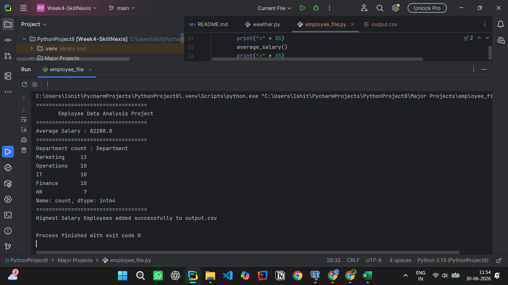
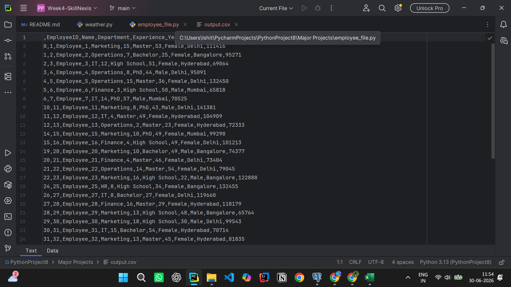
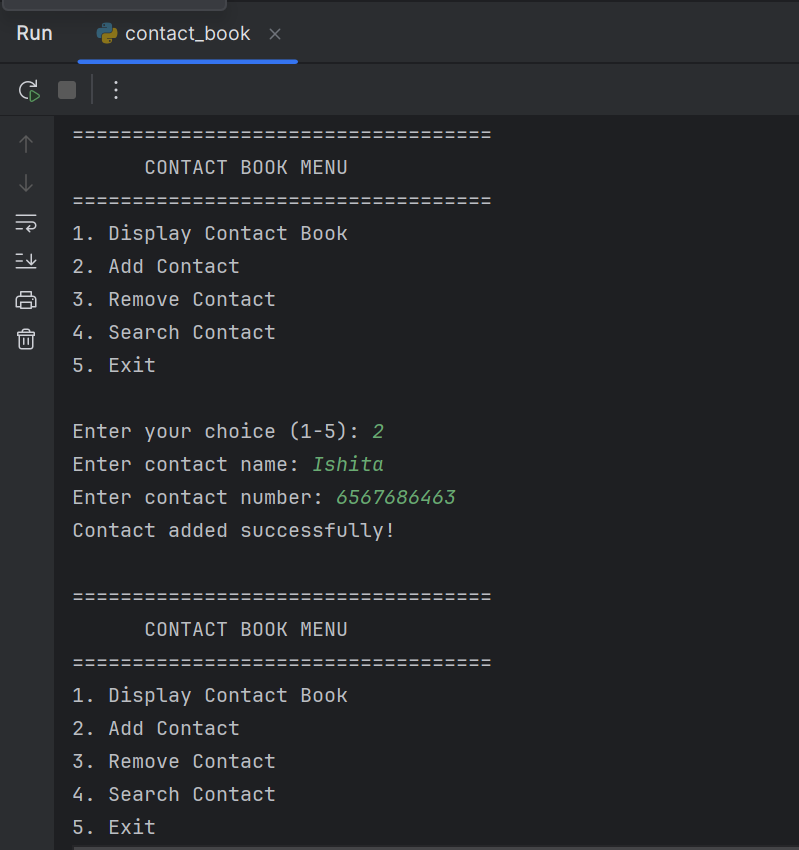
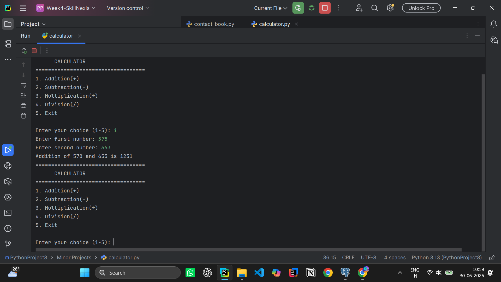
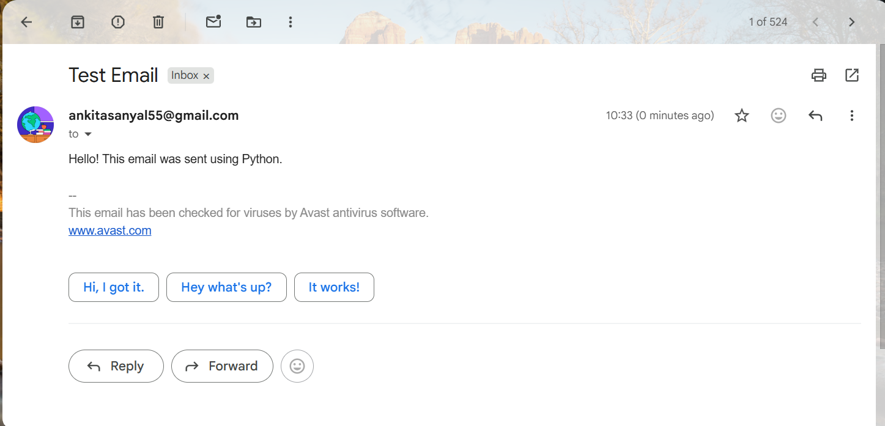
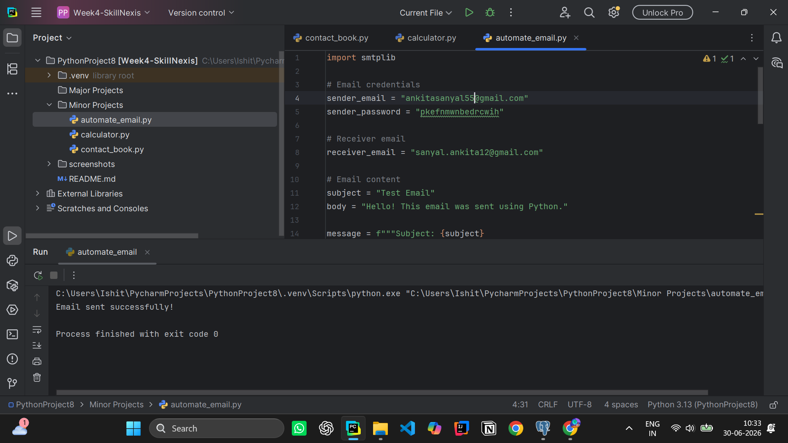
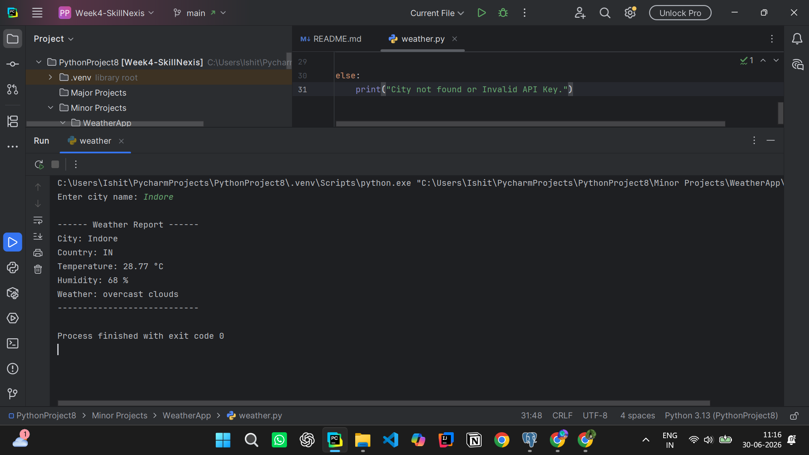
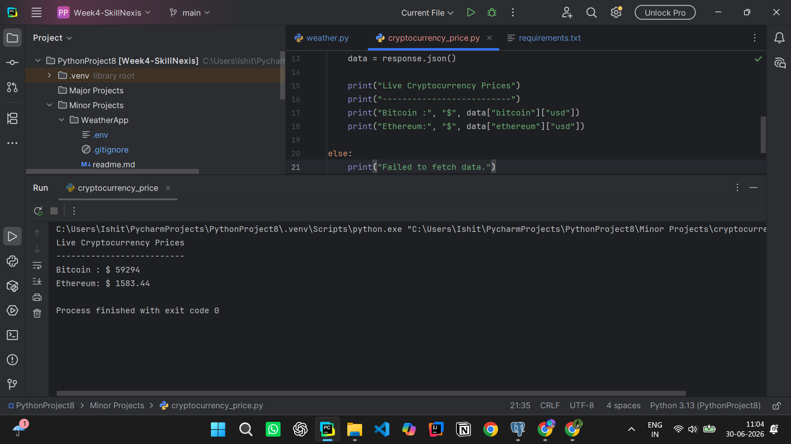

# Python Internship - Week 4

This repository contains the Week 4 mini projects and major project completed during my Python Internship.

---

# Major Project

## Employee Data Analysis Project

A simple employee data analysis project built using **Python** and **Pandas**.

### Dataset
- Employee Dataset (Kaggle)

### Tasks Performed
- Load employee dataset using Pandas
- Calculate average salary
- Count employees by department
- Filter employees above a salary threshold
- Export filtered data to a new CSV file

### Skills Gained
- Pandas
- CSV Handling
- Data Filtering
- Data Analysis

### Screenshot

---

#  Week 4

## 🔹 Mini Projects

### 1. Contact Book
A simple contact book application using Python dictionaries.

---

### 2. Simple Calculator
A menu-driven calculator built using Python functions.

---

### 3. Email Automation
A Python program to send emails using the `smtplib` library.

---

### 4. Weather App
A beginner-friendly weather application using the OpenWeather API.

---

### 5. Live Cryptocurrency Prices
A Python program that fetches live cryptocurrency prices using an API.

---

## 🛠 Technologies Used

- Python
- Pandas
- Requests
- smtplib
- python-dotenv
- OpenWeather API
- CoinGecko API

---

## 👨‍💻 Author

**Ankita Sanyal**